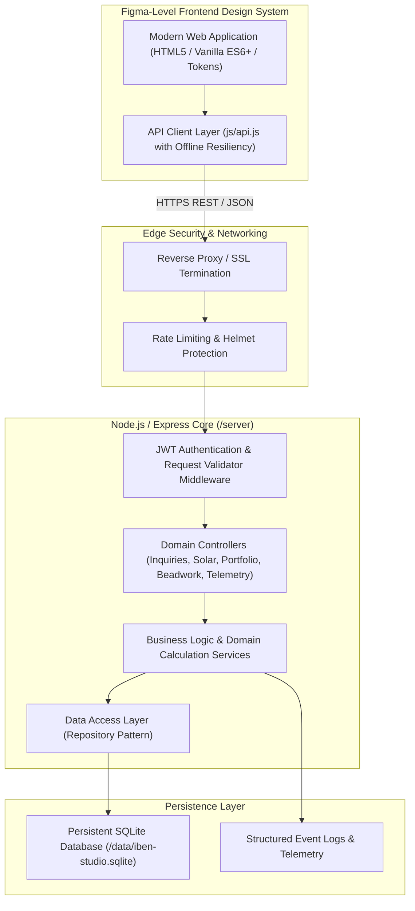
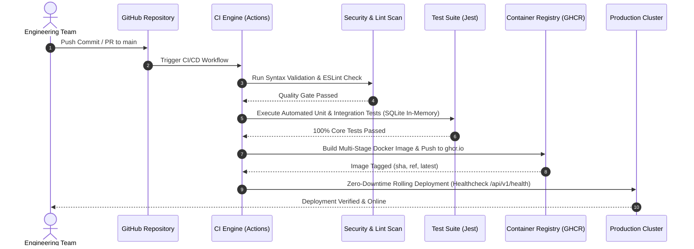

# IBEN STUDIO — Enterprise Senior Engineer Backend & Figma-Level Frontend Architecture

## 1. System Architecture & Topology

IBEN Studio is structured as an **Enterprise Full-Stack Application** featuring a clean-architecture **Node.js/Express REST API** backend (`/server`) and a **Figma-Level Atomic Design System** frontend (`/`, `/css`, `/js`).

---

## 2. CI/CD Breakdown & Deployment Lifecycle

The DevOps pipeline is implemented in `.github/workflows/ci-cd.yml` and structured across **4 Quality Gating Stages**:

### Stage 1: Code Quality & Syntax Verification
- Ensures ES6/Node JavaScript adherence and coding style compliance.
- Prevents unhandled exceptions or malformed payloads from entering staging.

### Stage 2: Automated Unit & Integration Testing
- Executes automated test suites using an **in-memory SQLite test database** (`:memory:`).
- Validates complex business logic:
  - **Solar Engineering ROI & System Sizing mathematical algorithms**.
  - **Inquiry validation & lead processing logic**.
  - **Portfolio filtering and bespoke Beadwork quote calculations**.

### Stage 3: Containerization & Artifact Registry
- Uses a **Multi-Stage Dockerfile** (`Dockerfile`) to isolate build-time dependencies from production runtime.
- Runs as a **non-root user (`ibenuser`)** with restricted permissions for maximum container security.

### Stage 4: Zero-Downtime Production Deployment
- Orchestrated via `docker-compose.yml`.
- Continually monitors container health via the `/api/v1/health` endpoint (`HEALTHCHECK --interval=30s`).

---

## 3. Backend Domain Modules Breakdown

### 3.1 Solar Engineering Calculator Module (`/api/v1/solar/calculate`)
- **Inputs**: Average daily load (kWh or kW), peak power demand, required backup hours, sunlight hours (e.g., 5.5 hours/day in Lagos).
- **Calculations**:
  - **Recommended Inverter Capacity (kVA)**: Includes a safety factor of 1.25x for peak surge.
  - **Battery Bank Requirements (kWh)**: Calculated based on backup hours and 80% Depth of Discharge (DoD) for Lithium-Iron-Phosphate (LiFePO4).
  - **Solar Array Sizing (kWp)**: Calculates required number of 550W solar modules.
  - **Financial ROI Analysis**: Estimates total cost in Nigerian Naira (₦), payback period in years, and annual carbon offset (kg CO₂).

### 3.2 Client Intake & Inquiries Module (`/api/v1/inquiries`)
- Validates customer lead submissions across all four studio disciplines.
- Manages inquiry lifecycle (`pending` -> `reviewed` -> `in-progress` -> `closed`).
- Implements spam protection and input sanitization.

### 3.3 Dynamic Portfolio & Case Study Module (`/api/v1/portfolio`)
- Provides RESTful filtering of IBEN Studio's portfolio across:
  - `web-development`
  - `software-applications`
  - `solar-engineering`
  - `beadwork-fashion`
- Supports detailed case study retrieval with tech stack tags, metrics, and high-resolution imagery.

### 3.4 Telemetry & Health Monitoring (`/api/v1/health`)
- Exposes uptime, memory footprint, database connectivity status, and system version for automated cloud monitoring.

---

## 4. Figma-Level Frontend Architecture

The frontend uses a structured **Design Token System** (`css/tokens.css`) to bridge UX design specifications with production CSS:

- **Color Tokens**:
  - `--color-onyx`: `#111111` (Primary Dark Ground)
  - `--color-cream`: `#F7F4EF` (Primary Light Text/Accent)
  - `--color-gold`: `#C89B3C` (Editorial Luxury Gold Accent)
  - `--color-terra`: `#B85235` (Earth/Solar Terra Cotta Accent)
  - `--color-charcoal`: `#1E1E1E` (Card/Surface Elevation)
- **Typography Hierarchy**:
  - `--font-serif`: `'Playfair Display', Georgia, serif` (Editorial Headlines)
  - `--font-sans`: `'Space Grotesk', -apple-system, sans-serif` (Precision Body & UI)
  - `--font-mono`: `'Space Mono', monospace` (Technical Specs & Data Pills)
- **Component Atomic Hierarchy**:
  - **Atoms**: Status pills (`.live-status-pill`), buttons (`.nav-cta`), form inputs.
  - **Molecules**: Filter tabs (`.filter-tab`), stat cards (`.solar-result-card`).
  - **Organisms**: Interactive Sizing Modal (`.solar-modal`), Lightbox Gallery (`.portfolio-modal`), Contact Form with API State.
